# Sabin Basnet

A profile README template with an automated market exchange section.

<!-- MARKET_START -->
## 📈 Profile Stock Exchange

  

### ⚡ Live Market Snapshot

<table>
  <tr>
    <td><strong>Current Price</strong></td>
    <td>$2.50</td>
    <td><strong>24h Change</strong></td>
    <td>+25.00%</td>
  </tr>
  <tr>
    <td><strong>Total Volume</strong></td>
    <td>3</td>
    <td><strong>Trend</strong></td>
    <td>▲ Bullish</td>
  </tr>
</table>

  
  

Welcome to the automated market exchange for this profile.

### Live Market Snapshot
- Current stock price: $2.50
- 24h change: +25.00%
- Total volume: 3

### Trade Now
- [BUY 1 SHARE](https://github.com/Sabin-Basnet/Sabin-Basnet/issues/new?title=market%3A+BUY)
- [SELL 1 SHARE](https://github.com/Sabin-Basnet/Sabin-Basnet/issues/new?title=market%3A+SELL)

### 🏆 Top 10 Shareholders & Profit Leaderboard

| Rank | Investor | Shares Owned | Avg Buy Price | Total Profit/Loss |
| --- | --- | ---: | ---: | ---: |
| 1 | @demo | 3 | $1.50 | $3.00 |
| 1 | @demo | 2 | $1.25 | $2.50 |
| 2 | @Sabin-Basnet | 1 | $2.00 | $0.50 |
<!-- MARKET_END -->
